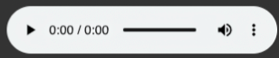

# Text-to-Speech API

A FastAPI-based backend service for converting text to speech using the Google Text-to-Speech (`gtts`) library. This API allows you to generate spoken audio from text input with various customization options.

## Features
- Convert text to speech in multiple languages.
- Configure speech speed and volume.
- Easy-to-use API with interactive documentation.

## Badges


## Table of Contents
- [Installation](#installation)
- [Running the Server](#running-the-server)
- [Usage](#usage)
- [API Documentation](#api-documentation)
- [Example Request](#example-request)
- [Contributing](#contributing)
- [License](#license)
- [Acknowledgments](#acknowledgments)

## Installation

Clone the repository:
```bash
git clone https://github.com/CraftedByCode/text_to_speech.git
cd text_to_speech
```

# Setup Script for Application

```bash
# Poetry Installaation 
pip install poetry

# Activate the virtual environment and setup a project
poetry install
```
more about poetry : [docs](https://python-poetry.org/) 

## Running the Server

To start the FastAPI server:
```bash
poetry run uvicorn app.main:app --reload
```

The server will be available at `http://localhost:8000`.

## Usage

Access the interactive API documentation at:
- [Swagger UI](http://localhost:8000/docs)
- [ReDoc](http://localhost:8000/redoc)

## Example request
POST `/convert`
```
curl -X POST "http://localhost:8000/convert" -H "Content-Type: application/json" -d '{"text": "Hello, world!", "lang": "en"}'
```

## API Documentation

The API provides the following endpoint:

### `/convert`

Converts text to speech and returns a URL to the generated audio file.

#### Request

**Method:** `POST`

**Request Body:**
```json
{
  "text": "Hello, world!",
  "lang": "en"
}
```

**Parameters:**
- `text`: The text to be converted to speech.
- `lang`: The language of the text (e.g., `"en"` for English).a

#### Response

**Response Body:**
```json
{
  "audio_url": "http://localhost:8000/static/audio/filename.mp3"
}
```

- `audio_url`: URL to the generated audio file.

#### Request

**Method:** `GET`

#### Response

**Response Body:**




- `audio_url`: URL to the generated audio file.


## Contributing

Contributions are welcome! Please follow these steps to contribute:

1. **Fork the Repository**: Click the “Fork” button at the top right of the repository page to create a personal copy of the repo.

2. **Create a Branch**: Create a new branch for your changes:
    ```bash
    git checkout -b my-feature-branch
    ```

3. **Make Changes**: Make your changes and commit them with descriptive messages:
    ```bash
    git commit -m "Add feature X"
    ```

4. **Push Changes**: Push your changes to your fork:
    ```bash
    git push origin my-feature-branch
    ```

5. **Create a Pull Request**: Go to the original repository and create a pull request from your fork. Provide a clear description of the changes you made.

Please see [CONTRIBUTING.md](CONTRIBUTING.md) for more information.

## License

This project is licensed under the MIT License. See the [LICENSE](LICENSE) file for details.

## Acknowledgments

- [FastAPI](https://fastapi.tiangolo.com/) - A modern, fast (high-performance) web framework for building APIs with Python 3.7+.
- [gtts](https://pypi.org/project/gTTS/) - A Python library and CLI tool to interface with Google Text-to-Speech API.
